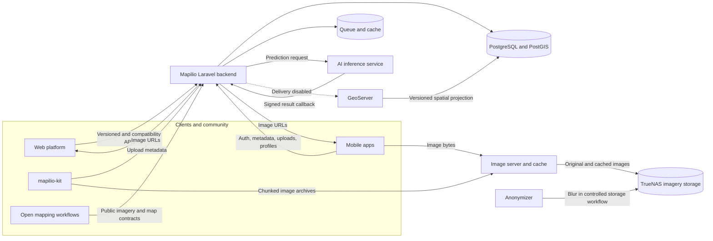

# Mapilio Backend

Mapilio is a street-level imagery platform for collecting, processing, and publishing geospatial imagery and detected street inventory. Its imagery and mapping integrations are designed to support open mapping workflows, including OpenStreetMap contributors, without implying endorsement by the OpenStreetMap Foundation.

This repository is the modern Laravel backend. It preserves API behavior required by existing web and mobile clients while replacing the legacy PyroCMS internals with explicit Mapilio domains, versioned APIs, and testable service boundaries.

> [!IMPORTANT]
> Modernization is active and there is no stable public release yet. External side effects such as AI dispatch, GeoServer publication, address enrichment, and UKM scoring remain disabled by default until their staging gates pass. The replacement operator dashboard is not implemented yet.

## Responsibilities

The backend owns:

- public, mobile, web, and compatibility API contracts;
- identity and access boundaries used by those APIs;
- imagery and sequence metadata, not image bytes;
- AI dispatch, signed callback receipt, canonical detection, and publication intent;
- canonical PostgreSQL/PostGIS records and versioned geospatial projections;
- operational safety gates for queues, backups, migrations, and releases.

Image storage and delivery, face and license-plate anonymization, AI inference, and GeoServer remain separate services. See the [ecosystem architecture](docs/architecture/ecosystem.md) for data flow and ownership boundaries.

## Architecture



The legacy database remains a migration source while compatibility routes are retired incrementally. Public behavior may be preserved; PyroCMS modules and generated table structures are not.

## Technology

- PHP 8.2 and Laravel 12
- PostgreSQL 14 with PostGIS for the target production schema
- SQLite for the safe local contributor workflow
- queues for prediction, enrichment, scoring, and publication work
- OpenAPI 3.1 for the modern `/api/v1` contract
- Vite for the small Laravel web asset surface

## Quick Start

Requirements: PHP 8.2+, Composer 2.2+, Node.js 22.12+ within major 22 or Node 24.x (the current LTS contributor option), npm 10+, and the documented PHP extensions. Other Node majors are unsupported until deliberately added. See the [platform matrix](docs/operations/contributor-platform-matrix.md), then run the read-only doctor before installing anything:

```bash
scripts/development/doctor.sh
```

```bash
git clone git@github.com:mapilio/backend.git
cd backend
composer install
npm ci
cp .env.example .env
php artisan key:generate
touch database/database.sqlite
```

Set an absolute SQLite path and explicitly enable synthetic local fixtures in `.env`:

```dotenv
APP_ENV=local
DB_CONNECTION=sqlite
DB_DATABASE=/absolute/path/to/backend/database/database.sqlite
MAPILIO_LEGACY_DB_CONNECTION=sqlite
MAPILIO_DEMO_SEEDING_ENABLED=true
```

Create the disposable schema and start Laravel:

```bash
php artisan migrate:fresh --seed
php artisan serve
```

Useful local endpoints:

- health: `http://127.0.0.1:8000/api/v1/system/health`
- synthetic AI feature: `http://127.0.0.1:8000/api/v1/geo/ai-features/900000001`
- [Synthetic local API cookbook](docs/api/local-api-cookbook.md) for read-only checks and safe response summaries

The demo seeder creates no account, password, legacy table, or external-service record. It refuses to run outside local/testing SQLite. Read the [full local setup and safety rules](docs/operations/local-development.md) before changing database configuration.

## API Contracts

- [Generated API reference](public/docs/api/index.html)
- [Modern OpenAPI 3.1 contract](docs/api/openapi-v1.json)
- [Synthetic local API cookbook](docs/api/local-api-cookbook.md)
- [Legacy compatibility policy](docs/architecture/0003-legacy-compatibility-endpoints.md)
- [Unsupported legacy surface guardrails](docs/architecture/0004-unsupported-legacy-surface-guardrails.md)
- [Current implementation status](docs/project-status.md)

Existing unversioned routes are compatibility contracts, not a pattern for new development. New public behavior belongs under an explicit versioned namespace and requires tests plus an OpenAPI change.

## Verification

Run the complete local repository gate before opening a pull request:

```bash
scripts/release/verify-local-readiness.sh
```

It checks locked dependency metadata and advisories, formatting, baseline-free level 6 static analysis across the application and database code, Laravel configuration caching, the full test suite, OpenAPI, the production asset build, Git history/worktree secrets, and redacted public-content policy across the candidate tree and complete history. Gitleaks `8.30.1` is required locally.

Focused commands:

```bash
php artisan test
composer format:test
composer analyse
npm run lint:openapi
npm run validate:api-examples
npm run check:api-docs
npm run check:license-state
npm run check:markdown-links
npm run audit:public-content
npm run build
```

GitHub Actions additionally runs every migration against a digest-pinned disposable PostgreSQL 14/PostGIS service. The [PostGIS migration gate](docs/operations/postgis-migration-gate.md) can also be run with a local Docker daemon.

## Contributing

Start with [CONTRIBUTING.md](CONTRIBUTING.md), then use the structured issue templates. Do not attach credentials, access tokens, database exports, production logs, personal data, unblurred imagery, private coordinates, or infrastructure details to an issue or pull request.

Security vulnerabilities must follow [SECURITY.md](SECURITY.md) and must never be posted publicly. General usage and project questions follow [SUPPORT.md](SUPPORT.md).

Maintainers use the [community issue triage policy](docs/community/issue-triage.md). The [initial issue catalog](docs/community/initial-issue-catalog.md) is a pre-public draft and does not authorize contribution work before the license and governance gates are complete.

## Documentation

- [Documentation index](docs/README.md)
- [Project roadmap](ROADMAP.md)
- [Ecosystem architecture](docs/architecture/ecosystem.md)
- [Domain boundaries](app/Domain/README.md)
- [Target database schema](docs/database/target-schema-draft.md)
- [Runtime and deployment](docs/operations/runtime-and-deployment.md)
- [Contributor platform matrix](docs/operations/contributor-platform-matrix.md)
- [Release readiness](docs/operations/release-readiness.md)
- [Security incident response](docs/security/incident-response.md)
- [Public-content audit](docs/security/public-content-audit.md)

## Governance And License

Community behavior is defined in [CODE_OF_CONDUCT.md](CODE_OF_CONDUCT.md). The repository is still private and its license has not been selected. Root Composer and npm metadata therefore identify this project as proprietary/unlicensed; those markers do not change the licenses of third-party dependencies. No open-source license is implied until the owners add a reviewed `LICENSE` file and update the guarded metadata; see the [public-release decisions](docs/governance/public-release-decisions.md).
