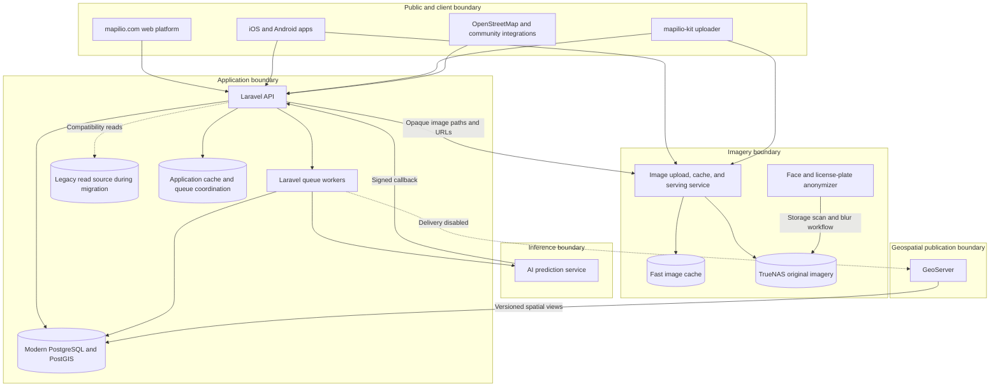

# Mapilio Ecosystem Architecture

## Purpose

Mapilio collects street-level imagery, associates it with geospatial metadata, detects street inventory, and exposes imagery and map contracts to web, mobile, and open mapping workflows. The modern backend coordinates metadata and workflow state. It does not absorb every ecosystem responsibility into one Laravel deployment.

## System Context

## Ownership Boundaries

| Component | Owns | Does not own |
| --- | --- | --- |
| Laravel backend | API contracts, auth boundaries, imagery metadata, sequence state, AI workflow state, canonical detections, publication intent | Image bytes, AI model execution, anonymization, GeoServer tile rendering |
| Mobile and web clients | User interaction, capture workflows, map presentation | Server credentials, canonical authorization decisions, service-to-service secrets |
| Image server | Mobile/chunk upload protocol, opaque storage paths, cache generation, image delivery | User/sequence database records, AI results, access-policy source of truth |
| TrueNAS | Durable original imagery storage | Application metadata and API behavior |
| Anonymizer | Detecting and blurring faces/license plates in the controlled storage workflow | Public API, user database, AI inventory prediction |
| AI service | Prediction execution and signed result delivery | Canonical persistence, public publication state, client authorization |
| GeoServer | Spatial layer and tile publication | Canonical workflow decisions, upload state, identity |
| PostgreSQL/PostGIS | Canonical modern records and versioned spatial projections | Original image bytes and cache files |

## Critical Flows

### Imagery upload

1. Mobile uploads image bytes through the image server's mobile contract; mapilio-kit uses resumable chunked archives.
2. The image server returns an opaque storage-path token. Clients and the backend must not reinterpret it as a content hash.
3. The authenticated client submits imagery and sequence metadata to Laravel.
4. Laravel validates ownership, records metadata idempotently, calculates local quality fields, and may queue separately approved work.
5. Image URLs are generated from the stable image-server contract. Laravel does not proxy original bytes.

### Anonymization and serving

1. The anonymizer scans controlled TrueNAS storage independently.
2. Images must not be declared privacy-ready merely because upload metadata exists.
3. Cache publication and serving need a verified holdback policy so an original cannot become publicly visible before required blurring succeeds.
4. Failure, retry, quarantine, and audit behavior remain deployment gates until proven in staging.

### AI prediction

1. A disabled-by-default queue job reserves one sequence prediction and calls an approved HTTPS AI endpoint with an idempotency key.
2. The AI service returns results through the signed callback contract.
3. Laravel stores an encrypted receipt, rejects replay, validates ownership and geometry, and persists a canonical detection graph transactionally.
4. Status projection and geospatial publication are independent retryable stages.

### Geospatial publication

1. Canonical detections expose a versioned PostGIS Point projection with SRID 4326 and a GiST index.
2. Laravel reconciles expected and projected feature counts before marking publication intent ready.
3. Existing GeoServer layers are not silently replaced. Delivery and cache invalidation remain disabled until the catalog, permissions, client contracts, and rollback are approved.

## Trust And Privacy Rules

- Browser and mobile inputs are untrusted even when they come from a signed-in user.
- Service callbacks require explicit authentication, replay protection, bounded payloads, and idempotency.
- Original imagery, unblurred faces/license plates, account data, production coordinates, and infrastructure evidence must not enter public issues, fixtures, or logs.
- The backend accepts forwarded client metadata only from explicitly configured proxies.
- Local and CI workflows must fail closed before destructive database or write-capable external operations.
- Production secrets belong in deployment secret management, never client bundles, repository files, command examples, or completed public evidence.

## Migration Strategy

The legacy backend and database remain behavior/data discovery sources during migration. The modern system uses route-by-route compatibility tests, explicit source-to-target mapping, repeatable backfill, aggregate/geospatial reconciliation, and reversible traffic changes. It does not recreate PyroCMS merely to preserve internal structure.

The authoritative release gates are in [release readiness](../operations/release-readiness.md). Individual decisions are recorded in the [architecture decision records](../README.md#architecture-decisions).
